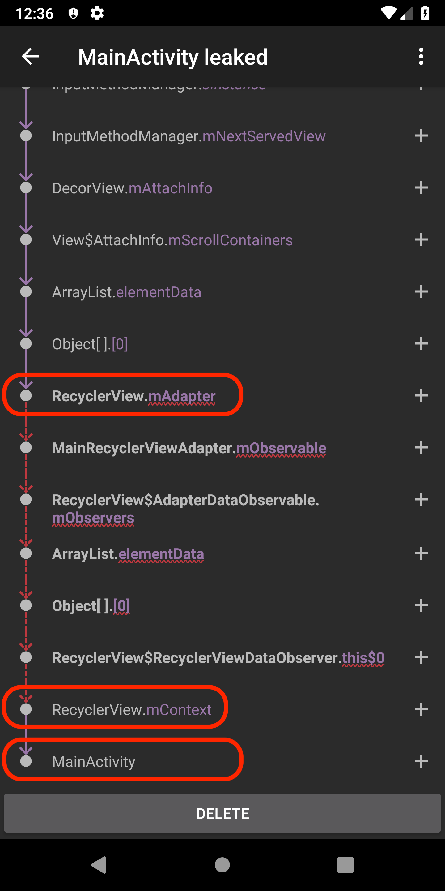
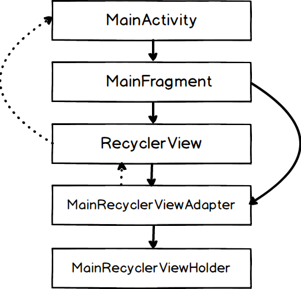
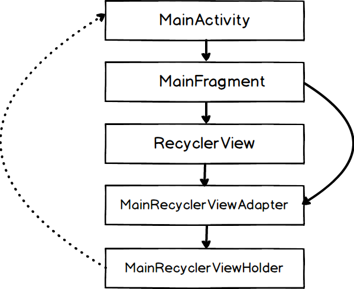

# RecyclerViewMemoryLeak
`RecyclerView` 周りで起きるメモリリークの実験

## `RecyclerView.adapter` が `Activity` よりも長生きする場合

### メモリリーク
このアプリは、以下の図のようなベーシックな構造をとっています。


`Fragment` が `RecyclerView` を表示していて、その `adapter` がカスタムの `ViewHolder` を供給しています。一つだけ、通常(!?) の構造から逸脱しているとすれば、それは `Fragment` が `adapter` への参照を保持していることです。せっかく `Fragment` を使っているので、`adapter` の生存時間を `Fragment` に合わせ、回転等が起きても `adapter` の状態を維持できるようにしています。

しかし、この参照が、どうもメモリリークを引き起こすようです。

[LeakCanary](https://github.com/square/leakcanary) によるリークのツリーは以下のようになります。



これによると、GC root から `RecyclerView.mAdapter` への参照が保持される限り、`Activity` がリークする、と読めます。

つまり、どうも普段は意識していないですが、 `RecyclerView.Adapter` から `RecyclerView` 経由で `Activity` への参照が内部的に張られているようです。 (下図点線参照)



### 解決法 1

`adapter` の生存期間を `Activity` に合わせる。 

```
class MainActivityFragment : Fragment() {
    // Discard permanent reference to the adapter
-   val adapter = MainRecyclerViewAdapter()
-	
    override fun onCreate(savedInstanceState: Bundle?) {
        super.onCreate(savedInstanceState)
        return inflater.inflate(R.layout.fragment_activity_main, container, false)
    }
 
    override fun onViewCreated(view: View, savedInstanceState: Bundle?) {
        super.onViewCreated(view, savedInstanceState)

        // Recreate adapter instance every time after rotation
-       recyclerView.adapter = adapter
+       recyclerView.adapter = MainRecyclerViewAdapter()
        recyclerView.layoutManager = LinearLayoutManager(activity!!)
    }
} 
```

この解決方法は、原因を考えればわかりやすいですが、 `adapter` に状態を保持できなくなる、という欠点があります。回転が起きると `adapter` は毎度初期化されるので、状態はどこか別に保存しておいて、そこから随時読み込むという形にする必要があります。[コードベース](https://github.com/yfujiki/RecyclerViewMemoryLeak/tree/fix-adapter-memory-leak-1)

### 解決法 2

`onDestroyView` で `recyclerView.adapter = null` を呼んでやるだけです。

```
class MainActivityFragment : Fragment() {
    // Discard permanent reference to the adapter
-   val adapter = MainRecyclerViewAdapter()
-	
    override fun onCreate(savedInstanceState: Bundle?) {
        super.onCreate(savedInstanceState)
        return inflater.inflate(R.layout.fragment_activity_main, container, false)
    }
 
-   override fun onDestroyView() {
-       super.onDestroyView()
-       recyclerView.adapter = null
-   }
-
    override fun onViewCreated(view: View, savedInstanceState: Bundle?) {
        super.onViewCreated(view, savedInstanceState) 
        recyclerView.adapter = adapter
    }
}
```

詳細は Android のコードを読まないとわかりませんが、`RecyclerView` => `adapter` の参照を切った時に `adapter` から `RecyclerView` の隠れ参照 (!?) も切ってくれて、循環参照がなくなるのだと思います。[コードベース](https://github.com/yfujiki/RecyclerViewMemoryLeak/tree/fix-adapter-memory-leak-2)


### まとめ

解決法 1 は「`adapter`に状態を持たせられない」という制限ができてしまうので、解決法 2 が汎用的でより良いと思われます。

一つ付け加えて起きたいのは、このタイプのメモリリークは `ViewPager` では起きません。おそらく、隠れ参照の張られ方が `RecyclerView` と違うのだと思います。

## Rx の `disposable` を `RecyclerView.ViewHolder` で使い、dispose しなかった/できなかった場合。

### メモリリーク

これは、`RecyclerView` に限った話ではなく、`Disposable` を dispose せずに放ってしまったという一般的なバグで起きることですが、「いつ dispose したらいいんだ」という問題は結構あって、 `RecyclerView` 特有の問題かな、と思いました。

```
class MainRecyclerViewHolder(itemView: View): RecyclerView.ViewHolder(itemView) {
    val disposable = CompositeDisposable()

    init {
        disposable += AppState.stateSubject.subscribe {
            itemView.textView.text = "Status : $it"
            someMethod()
        }
    }

    fun someMethod() {
        println("Doing nothing...")
    }
}
```

[このタグのコードベースでは](https://github.com/yfujiki/RecyclerViewMemoryLeak/tree/rx-observer-memory-leak)、カスタムの `ViewHolder` インスタンスが、スタティックな Rx `subject` に subscribe しています。明らかにここでは disposable を dispose してないんで、subscribe ブロックがリークします。ただ、それだけではなく、subscriber ブロックが `ViewHolder` への参照を持っているため `ViewHolder` がリークし、`ViewHolder` も内部的に `Activity` への参照を持っているようで `Activity` もリークします。LeakCanary によるリークツリーは以下のようになります。: 


普段意識しないですが、内部的には `ViewHolder` から `Activity` への参照があるということが伺えます。



### 解決法 1

`disposable` を `ViewHolder.finalize()` で `dispose` します。この時気をつけないといけないのは、subscriber ブロックから `ViewHolder` への参照は WeakReference で行なわないといけないということです。そうしないと、subscriber ブロックからの参照が生きているので `ViewHolder.finalize()` が永久に呼ばれず、`dispose` も呼ばれないことになってしまいます。[コードベース](https://github.com/yfujiki/RecyclerViewMemoryLeak/tree/fx-rx-observer-memory-leak-1)

```
     val disposable = CompositeDisposable()
 
     init {
+        val weakItemView = WeakReference<View>(itemView)
+        val weakSelf = WeakReference<MainRecyclerViewHolder>(this)
+
         disposable += AppState.stateSubject.subscribe {
-            itemView.textView.text = "Status : $it"
-            someMethod()
+            weakItemView.get()?.textView?.text = "Status : $it"
+            weakSelf.get()?.someMethod()
         }
     }
 
     fun someMethod() {
         println("Doing nothing...")
     }
+
+    protected fun finalize() {
+        if (!disposable.isDisposed()) {
+            disposable.dispose()
+        }
+        println("MainRecyclerViewHolder reclaimed")
+    }
```

この方法には `finalize()` がいつ呼ばれるか分からない、という問題があります。回転が起きた後 `ViewHolder` のインスタンスが画面からはデタッチされた後でも、GC が呼ばれるまで `finalize()` は呼ばれません。なので、GC が起きるまでの間、画面に表示されない `ViewHolder` インスタンスがゾンビのように生きていて Rx イベントを受け続けるという状態が起こり得ます。

### 解決法 2
`Activity` で `Disposable` インスタンスを生成し、パラメータとして `ViewHolder` まで受け渡し、`ViewHolder` ではそれを使う、という方法です。これで、回転が起きて `Activity` が死んだ時には、GC を待たずに subscriber ブロックも dispose することができます。[コードベース](https://github.com/yfujiki/RecyclerViewMemoryLeak/tree/fx-rx-observer-memory-leak-2)

MainActivity:

```
class MainActivity : AppCompatActivity() {
+   val disposable = CompositeDisposable()
 
    override fun onCreate(savedInstanceState: Bundle?) {
        super.onCreate(savedInstanceState)
        setContentView(R.layout.activity_main)
    }
 
+   override fun onDestroy() {
+       super.onDestroy()
+
+       if (!disposable.isDisposed) {
+           disposable.dispose()
+       }
+   }
```

MainActivityFragment: 

```
class MainActivityFragment : Fragment() {
 
-   val adapter = MainRecyclerViewAdapter()
+   private lateinit var adapter: MainRecyclerViewAdapter
 
    override fun onCreate(savedInstanceState: Bundle?) {
        super.onCreate(savedInstanceState)
 
+       adapter = MainRecyclerViewAdapter((activity as MainActivity).disposable)
        retainInstance = true
    }
    ...
```

MainRecyclerViewAdapter: 
``` 
-class MainRecyclerViewAdapter: RecyclerView.Adapter<MainRecyclerViewHolder>() {
+class MainRecyclerViewAdapter(val activityDisposable: CompositeDisposable) : RecyclerView.Adapter<MainRecyclerViewHolder>() {
    override fun onCreateViewHolder(parent: ViewGroup, viewType: Int): MainRecyclerViewHolder {
        val itemView = LayoutInflater.from(parent.context).inflate(R.layout.view_holder_main, parent, false)
-       return MainRecyclerViewHolder(itemView)
+       return MainRecyclerViewHolder(itemView, activityDisposable)
    }
    ...
``` 
 
MainRecyclerViewHolder:

```
-class MainRecyclerViewHolder(itemView: View): RecyclerView.ViewHolder(itemView) {
+class MainRecyclerViewHolder(itemView: View, val activityDisposable: CompositeDisposable): RecyclerView.ViewHolder(itemView) {
    val disposable = CompositeDisposable()
 
    init {
        disposable += AppState.stateSubject.subscribe {
            itemView.textView.text = "Status : $it"
            someMethod()
        }
+       activityDisposable.add(disposable)
    }
}
```

`ViewHolder` の生存期間が `Activity` と同じであると保証できる場合には解決法 2 は万全です。

しかし、`ViewHolder` が `Activity` が死んでからも生き続けるケースがある場合には (ソフトキーボード？）この方法はまずいです。`Activity` が死んだ後は、受け取るべきイベントを受けれない `ViewHolder` が出てきてしまいます。

また、`Activity` がまだ生きている間に `ViewHolder` が死ぬケースがある場合も問題です(複数の `Fragment` が `Activity` によって切り変えられるケース、など)。死んだはずの `ViewHolder` が Rx イベントを受け続ける事態が発生します。

### まとめ

該当スクリーンがソフトキーボードを表示することがなく、該当 `Activity` が複数 `Fragment` を切り替えて使用するようなこともない場合、解決法 2 は有効です。`Activity` が複数 `Fragment` を切り替えて使用している場合には、解決法 1 と解決法2 の合わせ技を使うのもありかもしれません。該当スクリーンがソフトキーボードを表示する場合は、`ViewHolder` で Rx を使用すること自体諦めた方が賢明だと思われます。

`ViewHolder` が死ぬ時に確実に呼ばれるコールバックがあれば (`onDestroy` 的な) 簡単に解決するのになぁ。。

## まとめのまとめ

- `RecyclerView.Adapter` が `Activity` より長生きした場合に `Activity` がリークする可能性があることと、その解決法を示しました。
- `RecyclerView.ViewHolder` で Rx を使った時に `Activity` がリークする可能性と、その場合の限定的な解決法を示しました。

全く意識してませんでしたが、LeakCanary のリークツリーによると、 `RecyclerView.Adapter`/`RecyclerView.ViewHolder` から `Activity` への隠れ参照があるようです。


