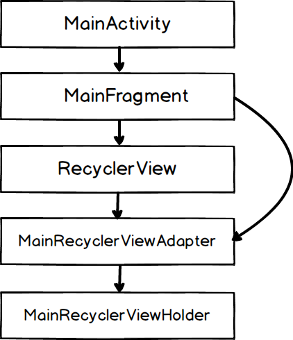
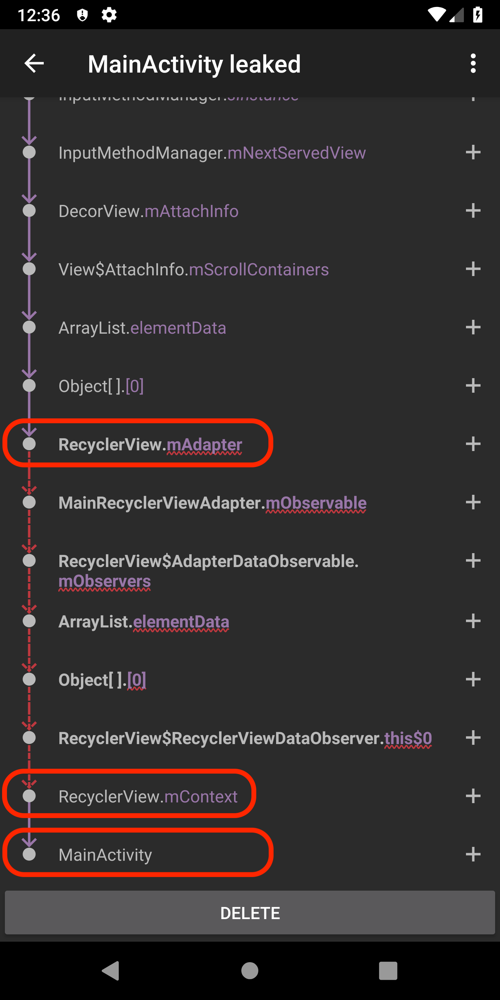
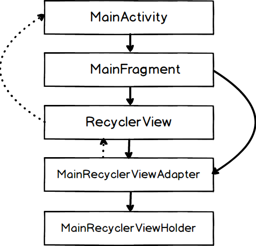
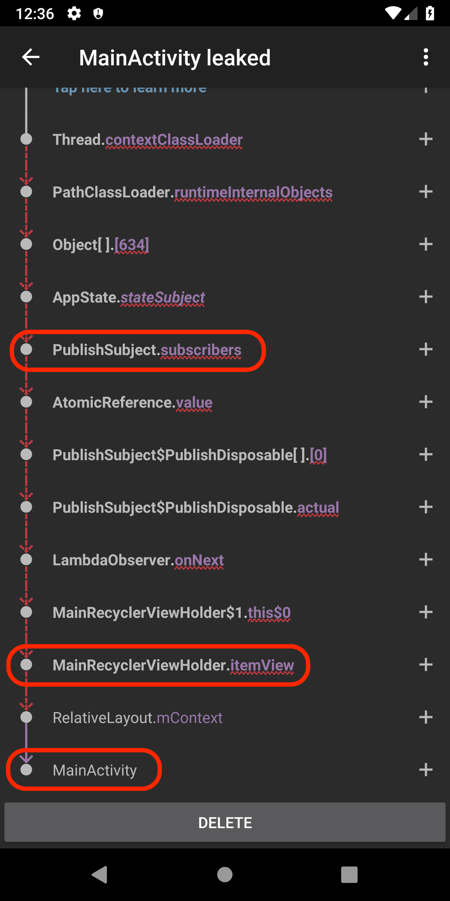
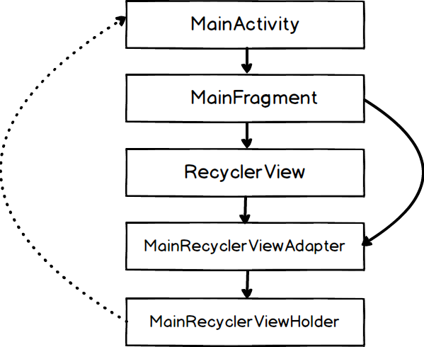
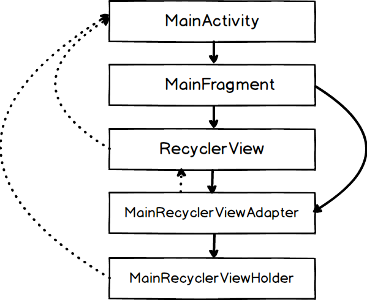

# RecyclerViewMemoryLeak
Experiment to see the condition when some memory leak happens with `RecyclerView`

## When `RecyclerView.adapter`'s lifetime is longer than `Activity`

### Memory Leak
The experiment app has the following very basic structure. 



One `Fragment` shows `RecyclerView`, whose `adapter` is providing custom `ViewHolder`s. One thing that may be deviating from standard(!?) such structure is that the `Fragment` is keeping the reference to the `adapter`, so that `adapter` has longer lifetime than the `Activity`. It is a sensible thing to do when you want to preserve the state in the adapter even after rotation.

However, this very thought seems to cause memory leak with [the naive implementation](https://github.com/yfujiki/RecyclerViewMemoryLeak/tree/adapter-memory-leak).

[LeakCanary](https://github.com/square/leakcanary) reports the following traversal toward the `Activity` instance.



This pretty much means that as long as you preserve the reference to `RecyclerView.mAdapter` from GC root, then `Activity` is going to leak.

I wasn't aware, but as I can see from the leak report, apparently there is a hidden reference from `RecyclerView.Adapter` to `Activity` through `RecyclerView`. (The dashed lines below indicates the hidden reference.)



### Solution 1

Change the lifetime of `adapter` to be the same as `Activity`. 

```
class MainActivityFragment : Fragment() {
    // Discard permanent reference to the adapter
-   val adapter = MainRecyclerViewAdapter()
-	
    override fun onCreate(savedInstanceState: Bundle?) {
        super.onCreate(savedInstanceState)
        return inflater.inflate(R.layout.fragment_activity_main, container, false)
    }
 
    override fun onViewCreated(view: View, savedInstanceState: Bundle?) {
        super.onViewCreated(view, savedInstanceState)

        // Recreate adapter instance every time after rotation
-       recyclerView.adapter = adapter
+       recyclerView.adapter = MainRecyclerViewAdapter()
        recyclerView.layoutManager = LinearLayoutManager(activity!!)
    }
} 
```

This approach makes sense, but it has a drawback that you cannot store any temporary state in the `adapter`. When rotation happens, you need to reconstruct that state from somewhere else, because `adapter` is created fresh at the time. [Code base](https://github.com/yfujiki/RecyclerViewMemoryLeak/tree/fix-adapter-memory-leak-1)

### Solution 2

Just set `recyclerView.adapter = null` in `onDestroyView` callback.

```
class MainActivityFragment : Fragment() {
    // Discard permanent reference to the adapter
-   val adapter = MainRecyclerViewAdapter()
-	
    override fun onCreate(savedInstanceState: Bundle?) {
        super.onCreate(savedInstanceState)
        return inflater.inflate(R.layout.fragment_activity_main, container, false)
    }
 
-   override fun onDestroyView() {
-       super.onDestroyView()
-       recyclerView.adapter = null
-   }
-
    override fun onViewCreated(view: View, savedInstanceState: Bundle?) {
        super.onViewCreated(view, savedInstanceState) 
        recyclerView.adapter = adapter
    }
}
```

This is very odd I find, because you are resetting `recyclerView.adapter` in `onViewCreated` later anyway, and thus you will lose the reference to the `adapter` sooner or later. I don't really see what difference it makes other than the timing when `adapter` is freed. But [this technique introduced in this SO post](https://stackoverflow.com/questions/35520946/leak-canary-recyclerview-leaking-madapter/46957469#46957469) certainly works. 

And this approach does not involve the drawback to disallow `adapter` to have any temporary state. (I know probably from modern architecture stand point, it is favored to configure `adapter` as stateless anyway, but sometimes it is handy to let it have a small temporary state.) [Code base](https://github.com/yfujiki/RecyclerViewMemoryLeak/tree/fix-adapter-memory-leak-2)

### Summary

My vote at this point is for Solution 2, since it does not have behavioral drawback. And one thing I want to add is that `ViewPager` doesn't cause this memory leak with the same structure. (`ViewPager` probably doesn't have reference to the underlying `Activity` to cause circular reference?)

## When you use Rx `disposable` in `RecyclerView.ViewHolder` and don't dispose. 

### Memory Leak

This is something that happens with general mistake of leaving `Disposable` instances undisposed, not a very specific issue in `RecyclerView`. However, when you have `disposables` in `RecyclerView.ViewHolder`, I found it extremely difficult to decide when it is good to dispose these, and it deserves thought specific to `RecyclerView`.

```
class MainRecyclerViewHolder(itemView: View): RecyclerView.ViewHolder(itemView) {
    val disposable = CompositeDisposable()

    init {
        disposable += AppState.stateSubject.subscribe {
            itemView.textView.text = "Status : $it"
            someMethod()
        }
    }

    fun someMethod() {
        println("Doing nothing...")
    }
}
```

Here in this [code base](https://github.com/yfujiki/RecyclerViewMemoryLeak/tree/rx-observer-memory-leak), the custom `ViewHolder` instance is listening to the state change from static Rx `subject`. Here, obviously we are not disposing the disposable, so it will leak the subscriber block. But not only that, because the subscriber block has a reference to the `ViewHolder`, the `ViewHolder` leaks too. And apparently, `ViewHolder` has a reference to the underlying `Activity` as well and `Activity` leaks eventually. The leak traversal from LeakCanary looks like this : 



This implies following hidden reference from `ViewHolder` to `Activity`.



### Solution 1

Dispose `disposable`s in the `finalize()` method of `ViewHolder`. One thing to note is that you have to "weak reference" `ViewHolder` from the subscriber block. Otherwise, `ViewHolder.finalize()` is never called because subscriber keeps reference to the `ViewHolder` instance.

```
     val disposable = CompositeDisposable()
 
     init {
+        val weakItemView = WeakReference<View>(itemView)
+        val weakSelf = WeakReference<MainRecyclerViewHolder>(this)
+
         disposable += AppState.stateSubject.subscribe {
-            itemView.textView.text = "Status : $it"
-            someMethod()
+            weakItemView.get()?.textView?.text = "Status : $it"
+            weakSelf.get()?.someMethod()
         }
     }
 
     fun someMethod() {
         println("Doing nothing...")
     }
+
+    protected fun finalize() {
+        if (!disposable.isDisposed()) {
+            disposable.dispose()
+        }
+        println("MainRecyclerViewHolder reclaimed")
+    }
```

However, this is not perfect because you never know when `finalize()` will be called. Even after rotation, when these `ViewHolder`s were discarded, `finalize()` will not be called until the next GC. So, technically it is possible that the `ViewHolder` instances in the memory keeps receiving Rx events until the next GC, even after they are not visible on the view.

### Solution 2
Trickle down `disposable` instance from Activity and use that `disposable` for `ViewHolder`'s subscriptions. This way, you can guarantee that the subscription block is canceled when `Activity` dies, regardless of the timing of next GC.

Change in MainActivity:

```
class MainActivity : AppCompatActivity() {
+   val disposable = CompositeDisposable()
 
    override fun onCreate(savedInstanceState: Bundle?) {
        super.onCreate(savedInstanceState)
        setContentView(R.layout.activity_main)
    }
 
+   override fun onDestroy() {
+       super.onDestroy()
+
+       if (!disposable.isDisposed) {
+           disposable.dispose()
+       }
+   }
```

Change in MainActivityFragment: 

```
class MainActivityFragment : Fragment() {
 
-   val adapter = MainRecyclerViewAdapter()
+   private lateinit var adapter: MainRecyclerViewAdapter
 
    override fun onCreate(savedInstanceState: Bundle?) {
        super.onCreate(savedInstanceState)
 
+       adapter = MainRecyclerViewAdapter((activity as MainActivity).disposable)
        retainInstance = true
    }
    ...
```

Change in MainRecyclerViewAdapter: 
``` 
-class MainRecyclerViewAdapter: RecyclerView.Adapter<MainRecyclerViewHolder>() {
+class MainRecyclerViewAdapter(val activityDisposable: CompositeDisposable) : RecyclerView.Adapter<MainRecyclerViewHolder>() {
    override fun onCreateViewHolder(parent: ViewGroup, viewType: Int): MainRecyclerViewHolder {
        val itemView = LayoutInflater.from(parent.context).inflate(R.layout.view_holder_main, parent, false)
-       return MainRecyclerViewHolder(itemView)
+       return MainRecyclerViewHolder(itemView, activityDisposable)
    }
    ...
``` 
 
 Change in MainRecyclerViewHolder:

```
-class MainRecyclerViewHolder(itemView: View): RecyclerView.ViewHolder(itemView) {
+class MainRecyclerViewHolder(itemView: View, val activityDisposable: CompositeDisposable): RecyclerView.ViewHolder(itemView) {
    val disposable = CompositeDisposable()
 
    init {
        disposable += AppState.stateSubject.subscribe {
            itemView.textView.text = "Status : $it"
            someMethod()
        }
+       activityDisposable.add(disposable)
    }
}
```

Solution 2 is good under the assumption that `ViewHolder`'s lifetime is the same as `Activity`'s. If there is a situation where `ViewHolder` is alive after `Activity` is destroyed (e.g., Soft keyboard coming up?), then we are doomed with this solution. If there is a situation where `ViewHolder` is reclaimed before `Activity` is destroyed (e.g., You switch `Fragment` dynamically inside the same `Activity`), then we are doomed with this solution too.

### Summary 

If the application doesn't involve Soft Keyboard on that screen, and if the application keeps the `Fragment` of the `RecyclerView` for the lifetime of `Activity`, then we should use Solution 2. If the application switches the `Fragment` of the `RecyclerView` inside the `Activity`, you can use Solution 1 to compensate for Solution 2. Otherwise, we should not use Rx in the `ViewHolder`. That's my conclusion for this case.

## Overall Summary

- The sample provides the solution when `Activity` is leaking due to `RecyclerView.Adapter`'s lifetime being longer than the `Activity`. 
- The sample provides the solution under restricted conditions and thought about the case where `Activity` leaks due to the usage of Rx in `RecyclerView.ViewHolder`.

Although I wasn't aware, LeakCanary tells me that there is a hidden reference like this from `RecyclerView.Adapter`/`RecyclerView.ViewHolder` to `Activity`.



