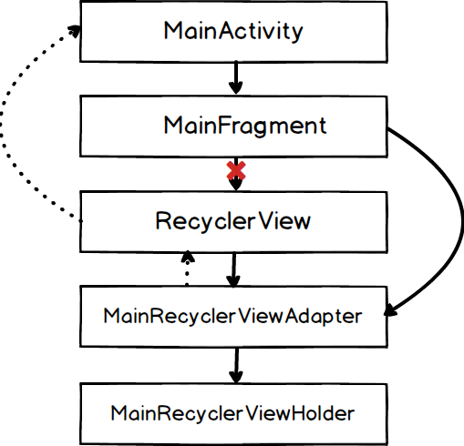

## Preface
This article is mostly meant for novis to mid level Android programmers, who haven't really digged into [LeakCanary](https://github.com/square/leakcanary) yet. I myself used it for the first time recently after delving into Android development for a year. And I am pleasantly surprised how powerful this tool is. This is definitely a must-include tool in every project. At the same time, I was surprised how Android maintains references under the hood for `RecyclerViews`. With naive expectation that `RecyclerView` itself should avoid circular references, you can easily fall into a trap of memory leaks. (And that's exactly the kind of reason that Square guys implemented [LeakCanary](https://github.com/square/leakcanary) and everybody should use it)

## How to use LeakCanary
It's pretty simple to use LeakCanary. As instructed in the [README section](https://github.com/square/leakcanary#getting-started), you just need to **1. describe dependency in gradle** and **2. write a few lines in your `Application` subclass**. And then LeakCanary will alert you of the memory leak in your __debug build__.

However, as straight-forward as it sounds, there was one pitfall I got into. If you are like me and prefers to press _Debug_ button instead of _Run_ button on Android Studio, **LeakCanary doesn't run while you are debugging**. You have to stop the debugging, and start the installed debug build from the launcher.

I have summarized this flow into a video, if this helps :

[](http://www.youtube.com/watch?v=RiYGSjguI9k "How to use LeakCanary ((after you have finished implementation)")

## Two cases you can easily make memory leak around RecyclerView

I have put two cases of memory leaks I encountered into this sample program. All codes are written in Kotlin.

### Case 1: `RecyclerView.adapter` outlives `Activity`.

#### Memory Leak: 
This sample program follows very standard structure as follows.


`Fragment` shows `RecyclerView` and it's `adapter` provides custom `Viewholder`s. One thing that deviates from standard(!?) structure is that the `Fragment` keeps reference to the `adapter`. This reference is meant to reuse `adapter` even after `Activity` is refreshed due to rotation etc. We are showing `RecyclerView` on top of the `Fragment`, so I think it is a sensible option to match the lifetime of `RecyclerView`'s `adapter` to the one of the `Fragment`.

This structure looks memory leak safe because there is no circular references. However, the expectation is false and LeakCanary detects that.

The object reference path provided by [LeakCanary](https://github.com/square/leakcanary) looks like this.


To my surprise, this diagram tells me that `RecyclerView.mAdapter` holds an indirect reference to `MainActivity` through `RecyclerView.mContext`. This is not a reference we made ourselves. This is a "hidden" reference, if we may call it.

So, the actual structure with this "hidden" reference (indicated by the dashed lines) is like the next diagram.



You can see there is a beautiful circular reference from `MainFragment` => `MainRecyclerViewAdapter` => `RecyclerView` => `MainActivity` => `MainFragment` and so on... Rotation happens, and `MainActivity` gets recreated, but since `MainFragment` still lives after rotation and keeps indirect reference to the old `MainActivity`, the old `MainActivity` will never reclaimed by GC and leaks.

As a side note, the `RecyclerView` is always recreated after rotation and reference from `MainFragment` to the old `RecyclerView` through Android-Kotlin extension never stays after rotation (indicated by the red cross in the diagram). That's how Android works.

#### Solution 1

A simple solution is to shorten the lifetime of `adapter` to match with the one of the `Activity`.

```kotlin
class MainActivityFragment : Fragment() {
    // Discard permanent reference to the adapter
-   val adapter = MainRecyclerViewAdapter()
-	
    override fun onCreate(savedInstanceState: Bundle?) {
        super.onCreate(savedInstanceState)
        return inflater.inflate(R.layout.fragment_activity_main, container, false)
    }
 
    override fun onViewCreated(view: View, savedInstanceState: Bundle?) {
        super.onViewCreated(view, savedInstanceState)

        // Recreate adapter instance every time after rotation
-       recyclerView.adapter = adapter
+       recyclerView.adapter = MainRecyclerViewAdapter()
        recyclerView.layoutManager = LinearLayoutManager(activity!!)
    }
} 
```

Every time when rotation happens, you will ditch `adapter` that holds an indirect reference to the old `Activity`, so that the `Activity` will not have a zombie reference. 

In terms of structure, we don't have the circular reference we had before, because there is no link from `Fragment` to `adapter` now. 


The cons of this approach is that you cannot save the temporary state in the `adapter`, because the `adapter` is initialized at every rotation. We have to save the temporary state somewhere else, and let the `adapter` to fetch the state after every initialization.

#### Solution 2

Another simple solution is to call `recyclerView.adapter = null` from `onDestroyView`.

```kotlin
class MainActivityFragment : Fragment() {
    // Discard permanent reference to the adapter
    val adapter = MainRecyclerViewAdapter()
	
    override fun onCreate(savedInstanceState: Bundle?) {
        super.onCreate(savedInstanceState)
        return inflater.inflate(R.layout.fragment_activity_main, container, false)
    }
 
+   override fun onDestroyView() {
+       super.onDestroyView()
+       // Note that this recyclerView is an old one
+       // and different instance from the one in onViewCreated.
+       recyclerView.adapter = null
+   }
+
    override fun onViewCreated(view: View, savedInstanceState: Bundle?) {
        super.onViewCreated(view, savedInstanceState) 
        // Note that this recyclerView is a new one
        // and different instance from the one in onDestroyView.
        recyclerView.adapter = adapter 
    }
}
```

Actually, I was surprised that this approach works. Even if you null out the reference from `RecyclerView` to `adapter`, as long as the `adapter` has a reference to `RecyclerView`, you still have circular reference. The only way I can comprehend this is that Android nulls out the reference from `adapter` to the `RecyclerView` as well when you null out the reverse relationship, thereby eliminating the circular reference.


### Summary of case 1

Even though I think solution 1 is by-the-book approach, note that it has a con that you can not let `adapter` to hold temporary status.  If you need `adapter` to maintain temporary status, then probably better to pick solution 2.

Another interesting point I want to note is that this type of memory leak does not occur with `ViewPager`. The way the `ViewPager` set "hidden" references should be a bit different from how `RecyclerView` does it.

## Case 2 : When you created Rx `disposable` in `RecyclerView.ViewHolder`, but you didn't/couldn't dispose it

### Memory Leak:

This case actually belongs to Rx domain rather than `RecyclerView` domain, and it is a trivial case in that it happens when you failed to dispose `Disposable` properly. But I found it not very trivial as of __when__ we should dispose `Disposable`, and that perspective is specific to the `RecyclerView`.

```kotlin
class MainRecyclerViewHolder(itemView: View): RecyclerView.ViewHolder(itemView) {
    val disposable = CompositeDisposable()

    init {
        disposable += AppState.stateSubject.subscribe {
            itemView.textView.text = "Status : $it"
            someMethod()
        }
    }

    fun someMethod() {
        println("Doing nothing...")
    }
}
```

A custom `ViewHolder` instance is subscribing to static Rx `subject`. Apparently in this case the subscription block leaks because we are not disposing the `disposable`. However, in addition to that, `ViewHolder` leaks asw well because the subscription block references `ViewHolder`. And to my surprise, the `ViewHolder` has a "hidden" indirect reference to `Activity`, and the `Activity` leaks too. (It surprised me quite a bit in this case especially because we are placing `RecyclerView` on a `Fragment`.)

The object reference path provided by LeakCanary would look like this.


You can see that there is a reference from `MainRecyclerViewHolder` to `MainActivity`.


### Solution 1

We can dispose `disposable` in `ViewHolder.finalize()`. One thing you have to note in this case is that you should reference `ViewHolder` instance as a __weak__ reference. Otherwise, the subscription block's reference keeps the `ViewHolder` instance alive, and `ViewHolder.finalize()` is never called. As a result, `disposable.dispose()` is never called as well.

```kotlin
     val disposable = CompositeDisposable()
 
     init {
+        val weakItemView = WeakReference<View>(itemView)
+        val weakSelf = WeakReference<MainRecyclerViewHolder>(this)
+
         disposable += AppState.stateSubject.subscribe {
-            itemView.textView.text = "Status : $it"
-            someMethod()
+            weakItemView.get()?.textView?.text = "Status : $it"
+            weakSelf.get()?.someMethod()
         }
     }
 
     fun someMethod() {
         println("Doing something...")
     }
+
+    protected fun finalize() {
+        if (!disposable.isDisposed()) {
+            disposable.dispose()
+        }
+        println("MainRecyclerViewHolder reclaimed")
+    }
```

This solution is probably an anti-pattern. Resorting to implementation in `finalize()` is always frowned upon, because you never know when it will be called. After `ViewHolder` instance was detached from the window after rotation, `finalize()` will not be called until the next GC. I haven't observed this, but it is theoretically possible that the detached `ViewHolder`s keeps receiving Rx events even though they are considered "dead" from application's perspective.

But you can save this as a last resort. The "dead" instances will be claimed eventually for sure.

### Solution 2

We can create `Disposable` instance in `Activity` instance and trickle it down to `ViewHolder`s for their use. This way, we can match the lifetime of `Disposable` and `Activity.

MainActivity:

```kotlin
class MainActivity : AppCompatActivity() {
+   val disposable = CompositeDisposable()
 
    override fun onCreate(savedInstanceState: Bundle?) {
        super.onCreate(savedInstanceState)
        setContentView(R.layout.activity_main)
    }
 
+   override fun onDestroy() {
+       super.onDestroy()
+
+       if (!disposable.isDisposed) {
+           disposable.dispose()
+       }
+   }
```

MainActivityFragment: 

```kotlin
class MainActivityFragment : Fragment() {
 
-   val adapter = MainRecyclerViewAdapter()
+   private lateinit var adapter: MainRecyclerViewAdapter
 
    override fun onCreate(savedInstanceState: Bundle?) {
        super.onCreate(savedInstanceState)
 
+       adapter = MainRecyclerViewAdapter((activity as MainActivity).disposable)
        retainInstance = true
    }
    ...
```

MainRecyclerViewAdapter: 

```kotlin
-class MainRecyclerViewAdapter: RecyclerView.Adapter<MainRecyclerViewHolder>() {
+class MainRecyclerViewAdapter(val activityDisposable: CompositeDisposable) : RecyclerView.Adapter<MainRecyclerViewHolder>() {
    override fun onCreateViewHolder(parent: ViewGroup, viewType: Int): MainRecyclerViewHolder {
        val itemView = LayoutInflater.from(parent.context).inflate(R.layout.view_holder_main, parent, false)
-       return MainRecyclerViewHolder(itemView)
+       return MainRecyclerViewHolder(itemView, activityDisposable)
    }
    ...
``` 
 
MainRecyclerViewHolder:

```kotlin
-class MainRecyclerViewHolder(itemView: View): RecyclerView.ViewHolder(itemView) {
+class MainRecyclerViewHolder(itemView: View, val activityDisposable: CompositeDisposable): RecyclerView.ViewHolder(itemView) {
    val disposable = CompositeDisposable()
 
    init {
        disposable += AppState.stateSubject.subscribe {
            itemView.textView.text = "Status : $it"
            someMethod()
        }
+       activityDisposable.add(disposable)
    }
}
```

This solution is perfect __in situation where the lifetime of `ViewHolder` and `Activity` should match.__

However, if there is a possibility that __`Viewholder` instance outlives `Activity` instance, this solution breaks__. After `Activity` is dead, there will be `ViewHolder`s who cannot receive Rx events. Having said that, I don't come up with any situation that would cause this situation. (i.e., `ViewHolder` to outlive `Activity`)

On the other hand, if a __`ViewHolder` instance is detached from the window while an `Activity` instance is alive, detached `ViewHolder` could keep receiving Rx events__. This scenario is more realistic. If you have multiple `Fragment`s in the `Activity` and if you are switching the `Fragment`s with `ViewPager`, a `RecyclerView` and its `ViewHolder`s on one `Fragment` could be detached from the window when another `Fragment` is displayed. In this case, __you can trickle down `Disposable`s from the `Fragment` instead of the `Activity`, because you want to match the lifetime of the `ViewHolder` to that of the `Fragment`__.

### Summary of case 2

I think the solution 2 can handle all of the cases. You will need to choose whether to match the `ViewHolder`'s lifetime to `Activity` or `Fragment`, but that's it.

I don't come up with a situation where `ViewHolder` instance can outlive parent `Activity`/`Fragment` instance, but if you have any idea, I would be pleased to receive a comment.

My lament is that our life would be so much easier if `ViewHolder` itself had a life cycle callback like `onDestroy`...

## Summary

- Memory leak can happen when `RecyclerView.Adapter` outlives `Activity`. But there is a solution for that!
- Memory leak can happen when you use Rx in `RecyclerView.ViewHolder`. But there is a solution for that!

I totally didn't have that in my mental model, but according to LeakCanary's reference path, __`RecyclerView.Adapter`/`RecyclerView.Viewholder` has indirect reference to parent `Activity`. (Even when you placed `RecyclerView` on top of a `Fragment`)__.


Bye bye memory leaks. Long live LeakCanary!!